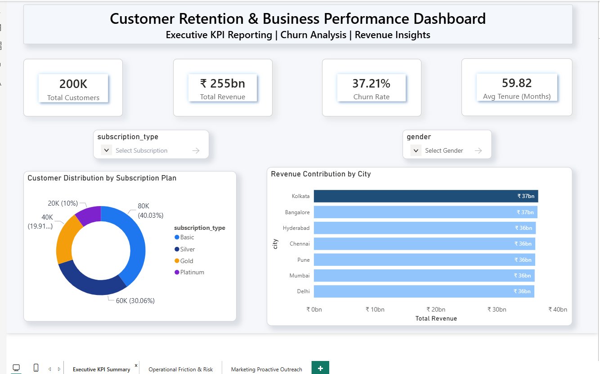
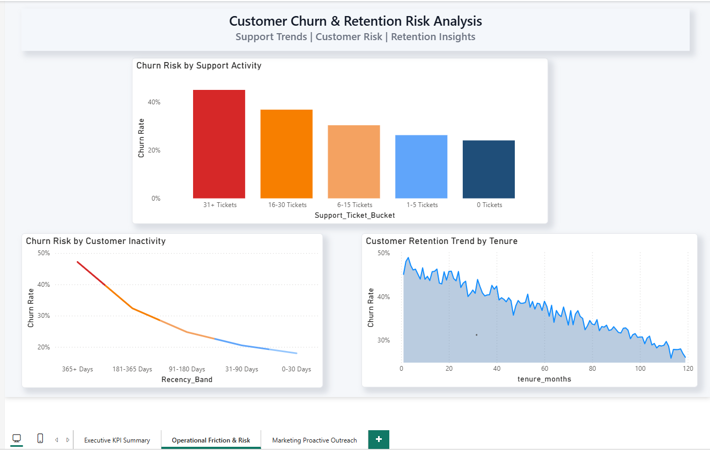
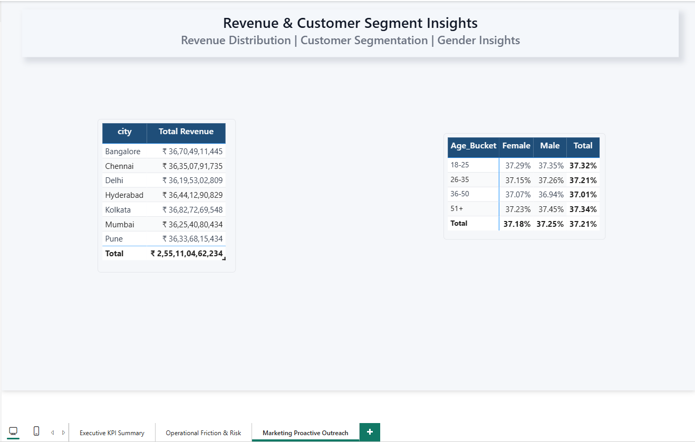

# Customer-Retention-and-Optimization
Customer churn analysis and business reporting project focused on customer retention, KPI tracking, and operational insights using Excel, SQL, and Power BI. Analyzed customer behavior, churn patterns, and revenue impact to generate actionable business insights and improve reporting efficiency through interactive dashboards and data visualization.

## Tools & Technologies
- SQL
- Power BI
- Python
- Excel

---

# Dashboard Screenshots & Key Insights

## Executive KPI Summary

### Key Insights
- Analyzed 200K+ customer records to monitor churn trends and customer retention performance.
- Identified overall churn rate exceeding 37%, highlighting customer retention risk.
- Tracked KPI metrics including revenue contribution, customer tenure, and subscription segmentation.
- Built executive-level reporting dashboard for business decision-making.

---

## Operational Friction & Risk Analysis

### Key Insights
- Customers with high support ticket activity showed significantly higher churn probability.
- Long inactivity periods strongly correlated with increased churn risk.
- Customer retention improved with increasing customer tenure.
- Support interaction trends helped identify high-risk customer groups.

---

## Revenue & Customer Segment Insights

### Key Insights
- Major metropolitan cities contributed the highest revenue share.
- Revenue distribution varied across customer subscription plans.
- Customer segmentation analysis identified profitable customer groups.
- Gender-based churn trends remained relatively consistent across customer segments.

---

# Business Impact
This dashboard helps businesses:
- improve customer retention strategies
- monitor churn risk
- track KPI performance
- identify high-value customer segments
- support executive reporting and business decision-making
